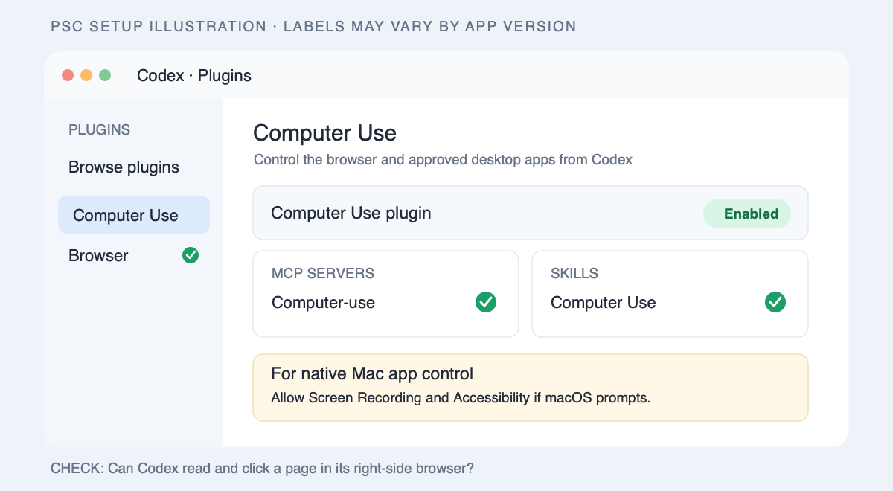
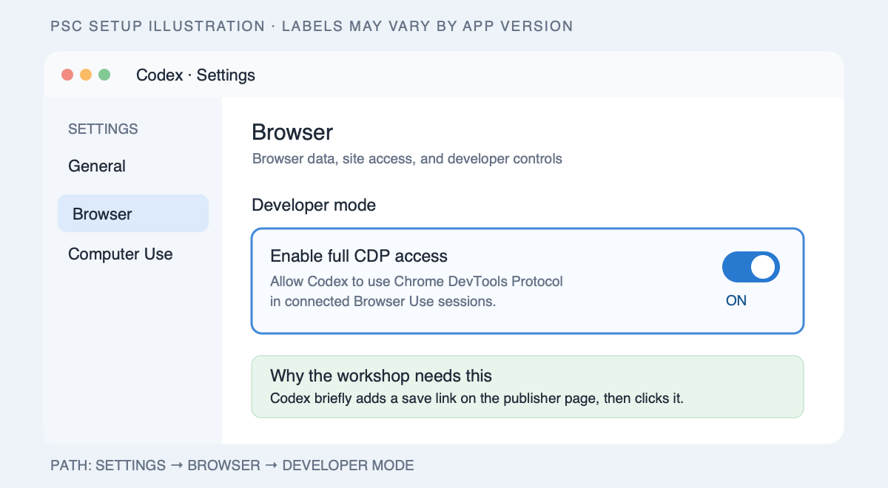
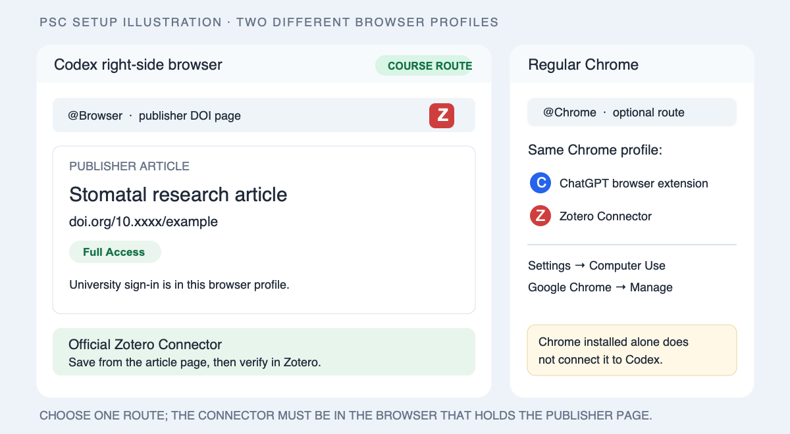
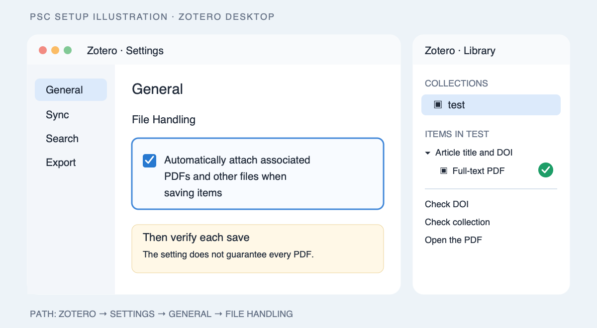

# Start here

This workshop uses Codex as a research assistant. You can complete the student activities with ordinary language; the assistant handles the browser and any code it needs.

## Set up the workshop browser

The pictures below are **illustrations of the controls to find**, not captures of this computer's Settings screen. The app's layout may change; use the written setting names if it does.

### 1. Enable Codex browser control

Open the Codex desktop app. In **Plugins**, install and enable **Browser** and **Computer Use** if prompted. For Computer Use, enable its server and skill toggles. Open the built-in browser in Codex's right-side view (`@Browser`). If Codex needs to operate a native Mac app window, grant the macOS **Screen Recording** and **Accessibility** permissions requested for Computer Use.

### 2. Enable page-scoped CDP

In **Settings → Browser → Developer mode**, turn on **Enable full CDP access**. The course Zotero skill needs this to show a temporary save link on the publisher page. Review Codex's site access request when it appears. An organisation policy may prevent this setting from being enabled.

### 3. Put the Connector in the browser you use

Install the official **Zotero Connector in Codex's built-in browser**. The built-in browser has its own profile; an extension installed only in regular Chrome is not available there. Install the course's `zotero-connector-collect` skill as directed by the instructor. Sign in to your university library **in this same browser** if an article requires institutional access. Participants from ETH Zurich, the University of Zurich, and the University of Basel may see different access results.

### 4. Prepare Zotero desktop

Open Zotero desktop. Create a collection named `test` and select it. In **Zotero → Settings → General → File Handling**, check **Automatically attach associated PDFs and other files when saving items**. This preference helps Zotero save PDFs when they are available; verify each article after saving.

## Readiness check

Ask Codex to open an original publisher DOI page in `@Browser`, identify its title and DOI, and save it through Zotero Connector into `test`. Then ask Codex to verify in Zotero that the item has the matching DOI, belongs to `test`, and has a PDF attachment that opens. A saved citation without a PDF does not complete the full-text exercise. If an article has no available PDF, choose another example and report the limitation.

This test confirms the browser, Computer Use, Connector, Zotero, and institution-specific access together. A settings switch alone does not prove the full workflow works.

## If your class uses regular Chrome

Regular Chrome is a **separate** route. Install Chrome and the **ChatGPT browser extension** in the Chrome profile you will use. In **Settings → Computer Use**, connect or enable **Google Chrome**; a connected browser shows **Manage**. Install the Zotero Connector in that same Chrome profile and invoke `@Chrome` in the task. The built-in-browser exercise above uses `@Browser` and does not require Chrome to be the Mac's default browser.

Mac Screen Recording and Accessibility permissions are separate from browser site access. The literature exercise verifies Zotero through its local API rather than clicking in the Zotero desktop window.

## Sources

- [Codex built-in browser and CDP setting](https://learn.chatgpt.com/docs/browser)
- [Computer Use setup and macOS permissions](https://learn.chatgpt.com/docs/computer-use)
- [Regular Chrome connection](https://learn.chatgpt.com/docs/chrome-extension)
- [Zotero automatic PDF attachment preference](https://www.zotero.org/support/preferences/general)
