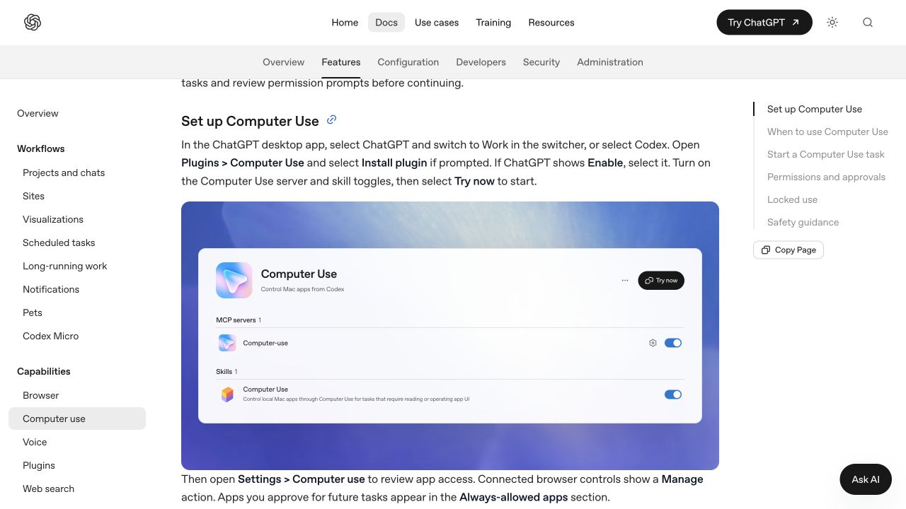
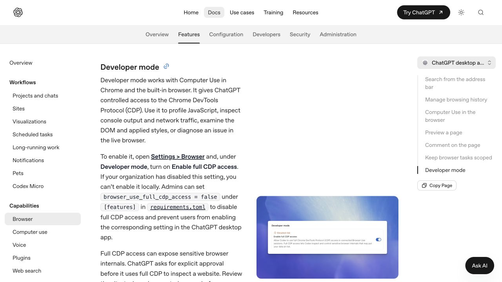
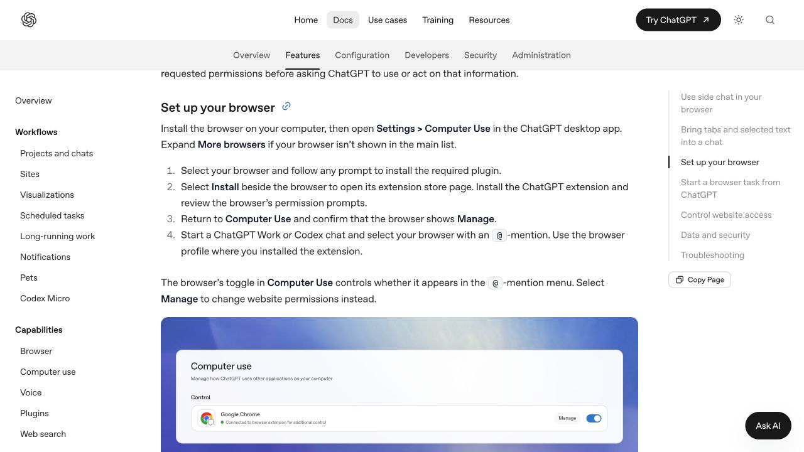

# Start here

This workshop uses Codex as a research assistant. Students can complete the activities with ordinary language. Start with the official download pages, then set up the browser that Codex will use.

## 1. Download the software

| Software | Official download page | Install |
| --- | --- | --- |
| Codex desktop | [ChatGPT desktop download](https://chatgpt.com/download/) | Install the current desktop app and select **Codex**. OpenAI says the app includes Codex; existing Codex app users can update to it. |
| Google Chrome | [Google Chrome download](https://www.google.com/chrome/) | Install Chrome if you plan to use regular `@Chrome` as well as the workshop's built-in browser. |
| Zotero | [Zotero download](https://www.zotero.org/download/) | Install Zotero desktop. The same official page links to **Zotero Connector**. |

Use the pages above rather than a copied installer file. The download buttons choose the current release for your computer.

## 2. Turn on Codex browser control

In the desktop app, select **Codex**. Open **Plugins → Computer Use**, install or enable it if prompted, and turn on its **Computer-use** server and **Computer Use** skill. Open Codex's right-side built-in browser with `@Browser`. The [official Computer Use setup guide](https://learn.chatgpt.com/docs/computer-use#set-up-computer-use) shows these controls.

*Captured from OpenAI's [Computer Use documentation](https://learn.chatgpt.com/docs/computer-use#set-up-computer-use) on 23 September 2026. This is the documentation page, not a screenshot of your settings.*

In **Settings → Browser → Developer mode**, turn on **Enable full CDP access**. The course Connector skill uses page-scoped CDP on the publisher article page. See the [official Browser guide](https://learn.chatgpt.com/docs/browser?surface=app#developer-mode).

*Captured from OpenAI's [Browser documentation](https://learn.chatgpt.com/docs/browser?surface=app#developer-mode) on 23 September 2026.*

## 3. Install Zotero Connector in the workshop browser

In Codex's **Settings → Browser**, use the browser's extension controls to install **Zotero Connector** into the built-in browser profile. Start from [Zotero's download page](https://www.zotero.org/download/) and confirm the linked [Connector listing](https://chromewebstore.google.com/detail/zotero-connector/ekhagklcjbdpajgpjgmbionohlpdbjgc) names **Corporation for Digital Scholarship** as developer. Confirm the Connector is available in the right-side browser. Keep Zotero desktop open, create a `test` collection, and select it. OpenAI's public browser guide does not currently show the built-in extension installation controls, so follow the controls in the installed app rather than a screenshot of an older version.

Install the course's `zotero-connector-collect` skill as directed by the instructor. If an article needs university access, sign in within the **same built-in browser profile**. An extension or university session in regular Chrome does not automatically appear in Codex's built-in browser. See [OpenAI's browser profile explanation](https://learn.chatgpt.com/docs/browser?surface=app).

## 4. Connect regular Chrome only if you will use `@Chrome`

In a regular Chrome profile, install the [ChatGPT browser extension offered by OpenAI](https://chromewebstore.google.com/detail/chatgpt/hehggadaopoacecdllhhajmbjkdcmajg). Install the [Zotero Connector](https://chromewebstore.google.com/detail/zotero-connector/ekhagklcjbdpajgpjgmbionohlpdbjgc) in that **same profile**. In Codex, open **Settings → Computer Use → Google Chrome** and follow **Install** if shown. A working connection shows **Manage**. The [official extension setup guide](https://learn.chatgpt.com/docs/chrome-extension#set-up-your-browser) explains this sequence, and [Google's extension instructions](https://support.google.com/chrome/answer/2664769?hl=en) show the installation prompts.

*Captured from OpenAI's [browser extension documentation](https://learn.chatgpt.com/docs/chrome-extension#set-up-your-browser) on 23 September 2026. Installing Chrome alone does not connect it to Codex.*

The tested workshop flow uses `@Browser` in Codex's right-side view. Chrome does not need to be your Mac's default browser for that flow.

## 5. Check the complete workflow

Open an original publisher DOI page in `@Browser`. Ask Codex to save it through Zotero Connector into `test`, then verify the DOI, collection, and opening PDF attachment in Zotero. A citation without a PDF is incomplete for this exercise. If Codex cannot control a native Mac app window, check macOS **Screen Recording** and **Accessibility** permissions as described in the [Computer Use guide](https://learn.chatgpt.com/docs/computer-use#set-up-computer-use).
