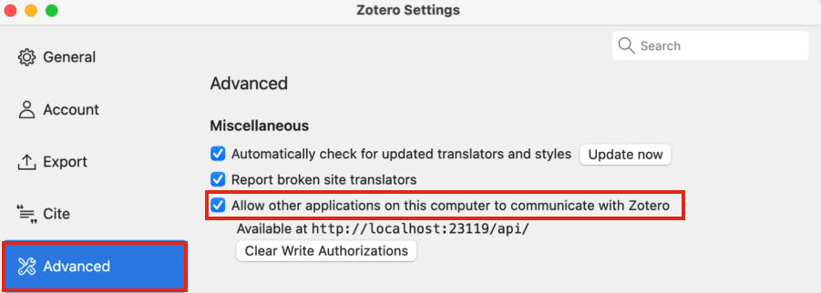
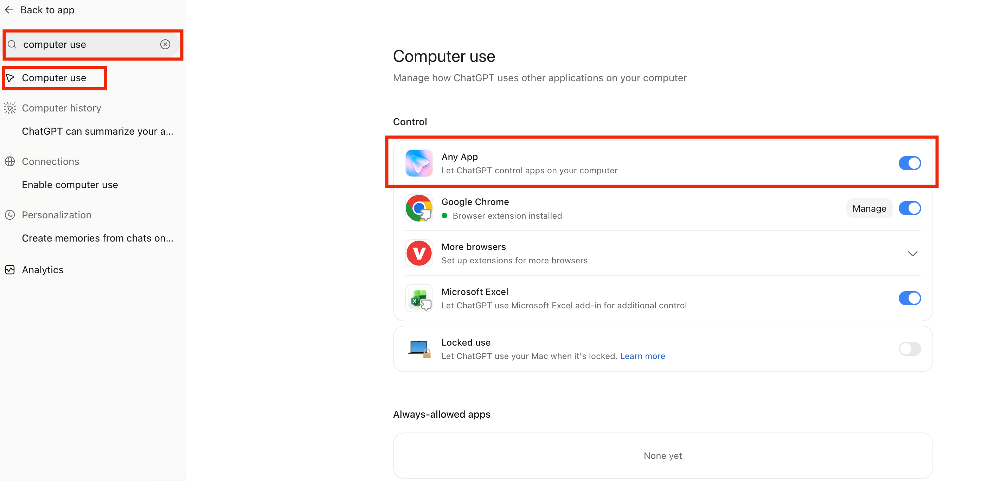
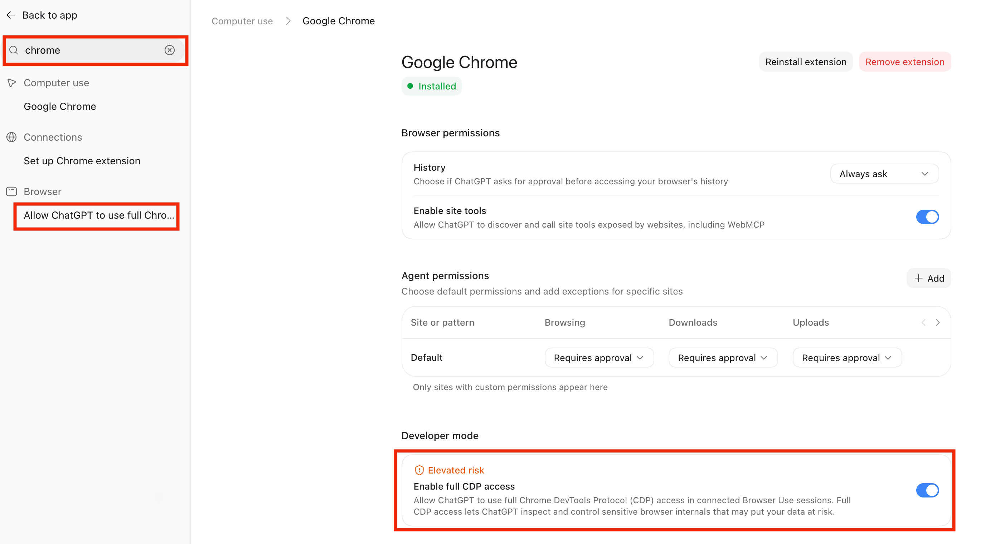
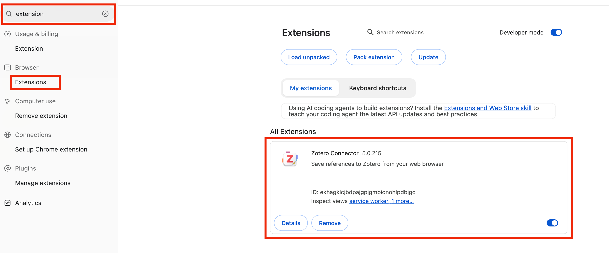
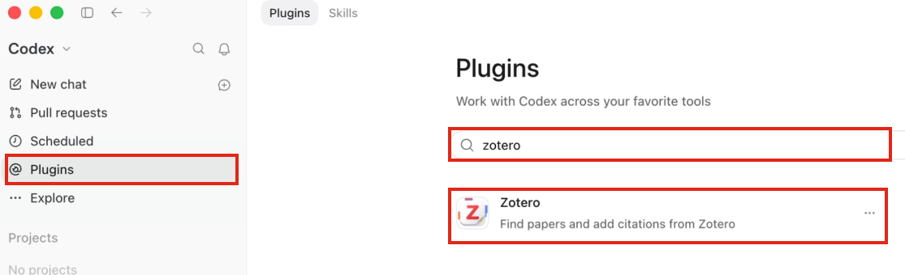

# Setup

## 1. Codex setup

1. **Install Codex:** Download the [desktop app](https://chatgpt.com/download/), sign in, and select **Codex**.
2. **Install Google Chrome:** Download [Chrome](https://www.google.com/chrome/), install it, and open it once.
3. **Install Zotero:** Download and open [Zotero desktop](https://www.zotero.org/download/). In **Settings → Advanced**, enable **Allow other applications on this computer to communicate with Zotero**. Keep Zotero open.

This lets Codex check your library and read saved paper text.

4. **Enable Computer Use:** In **Settings**, search `computer use`, open **Computer use**, and turn on **Any App**.

5. **Enable CDP:** In **Settings**, search `chrome` and turn on **Enable full CDP access**.

6. **Install Zotero Connector:** In Codex’s browser, open **Chrome Web Store** and install **Zotero Connector**.

## 2. Install the skills and Zotero plugin

In Codex, type `@`, select **skill-installer**, then paste:

> Install `skills/paper-search`, `skills/zotero-save`,
> `skills/paper-reading`, and `skills/paper-watch` from:
>
> `https://github.com/Alias-z/agentic-researcher-psc`
>
> If `python3` is unavailable, use the Python executable from `load_workspace_dependencies` for the installer.

To use a skill later, type `@` and select **paper-search**, **zotero-save**, **paper-reading**, or **paper-watch**.

For later paper reading, open **Plugins** in Codex, search `zotero`, and install **Zotero**. The plugin will be available in new chats.

- **paper-search:** find papers and DOIs.
- **zotero-save:** save selected papers and available PDFs through Zotero Connector.
- **paper-reading:** read saved papers and keep notes for your review.
- **paper-watch:** routinely reuse saved searches and reviewed notes, save new papers, and report relevant findings. Confirm its proposed schedule when you are ready. Scheduled runs need your computer awake, with Codex and Zotero open.
- **Zotero plugin:** read saved papers' indexed text and use citations.

**Exercises:** [Workshop exercises (PDF)](exercises.pdf).
